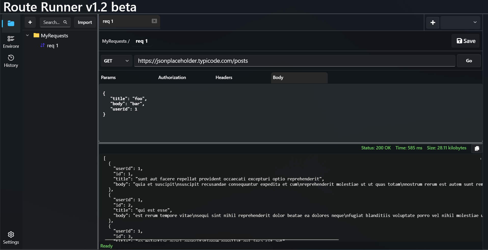
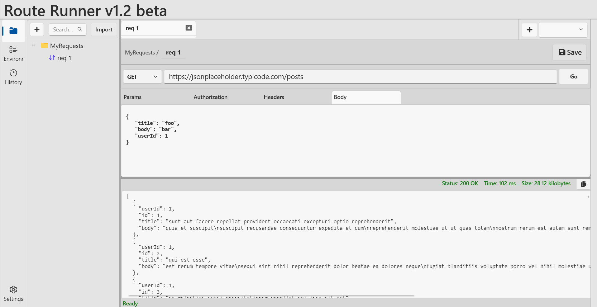

# Route Runner 🚀🌐

**Route Runner** is a minimalistic platform for testing APIs (Application Programming Interfaces). It allows developers to test APIs . Use it to simplify the process of testing APIs by providing a user-friendly interface for making requests, viewing responses, and debugging issues.

## Features 

- **HTTP Methods:** Supports GET, POST, PUT, PATCH, DELETE, and HEAD requests.
- **Request Management:** Save requests and organize them into folders.
- **SQLite Storage:** Requests and folders are stored using SQLite for efficient data management.

## Usage 

1. Launch the application.
2. Create and manage your API requests with various HTTP methods.
3. Save and organize your requests into folders.
4. Use upcoming features such as API headers, authentication, request history, and environment files to enhance your API testing.

## Technologies Used 🧰

- **.NET 9**
- **WPF**
- **Lepoco WPF UI library**
- **SQLite** for storing saved requests and folders

## Screenshots 📷

## Upcoming Features 💡
- Adding API headers
- Handling API authentication
- Request history tracking
- Environment file management

## Contribution 

🚀 **Contributions are welcome!** If you have ideas for features or improvements, feel free to:

- 🐛 Open an issue to report bugs or suggest features.
- 🔧 Submit a pull request to help improve the project.

We appreciate your contributions to make Route Runner even better! 🙌 

## Contacts

If you have any questions or want to get in touch, you can reach out through:

- 📧 Email: [ulmasaliyev2005@gmail.com](mailto:ulmasaliyev2005@gmail.com)
- 💼 LinkedIn: [Muxammadamin Ulmasaliyev](https://www.linkedin.com/in/muxammadamin-ulmasaliyev-419198251/)

Feel free to reach out with any inquiries or feedback! 😊

