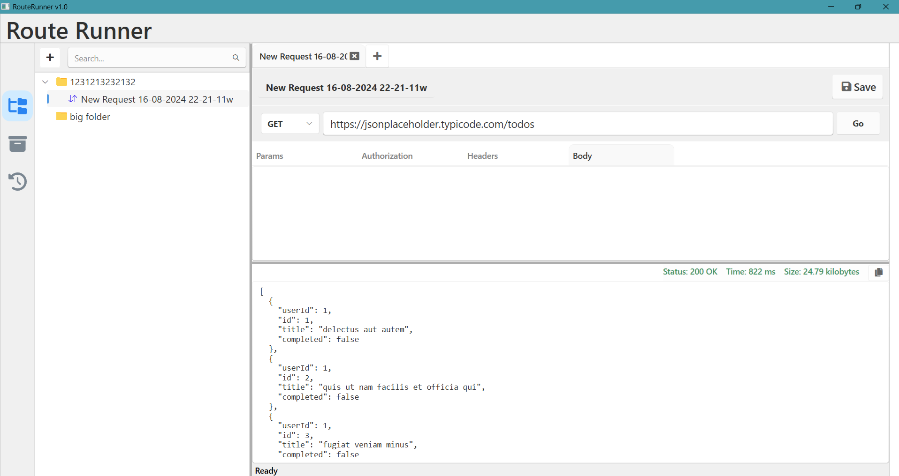

# Route-Runner-App
Route Runner offers an intuitive interface for making REST requests to APIs and displaying the responses in a formatted JSON view.
It's ideal for developers and testers, helping you efficiently validate and troubleshoot your API calls.

## Technologies used

* C#
* .NET 8
* WPF
* HttpClient

## Using The App
1. Download the files from the release section.

   

4. Fill in your API URL and hit Go:

## Upcoming changes
* Implementing POST, PUT , PATCH and DELETE functionality
* Adding API headers
* Handling API Authentication
* Adding Dependency injection
* Adding Logging
* Creating a section : "Saved API requests"
* Adding history of requests
* Adding environment files
  
  
